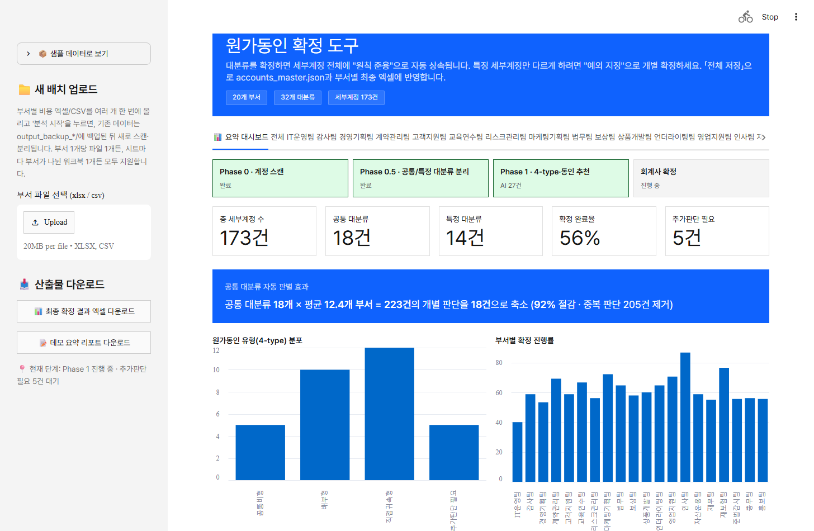
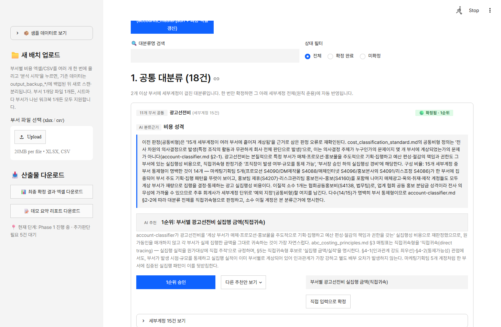
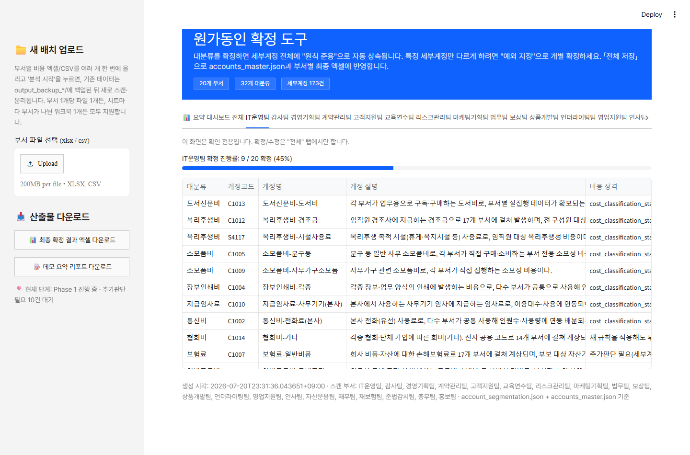
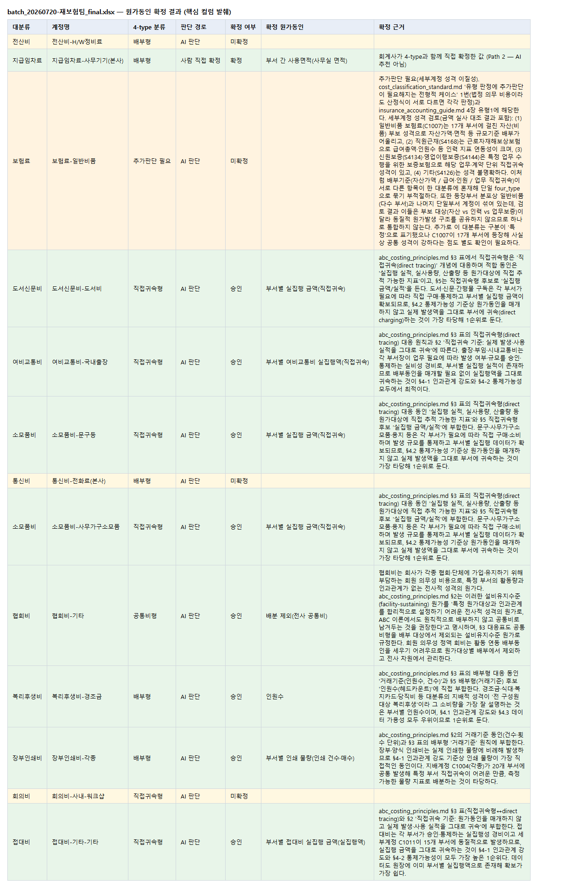

# 원가동인(Cost Driver) 추천 멀티 에이전트 시스템

손해보험사 관리회계 비용실사에서, 부서별 비용 계정을 업로드하면 **공통/특정 대분류 자동 분리 → 4-type 분류 → 원가동인(cost driver) 1~3순위 추천 → 회계사 검토·확정 → 엑셀 산출**까지 이어지는 워크플로우 도구입니다. 판단은 Claude 서브에이전트가 근거와 함께 추천하고, 최종 확정은 항상 회계사가 합니다.

> **배포:** [cost-driver-agent-kfemdr33ywdghm76v87qza.streamlit.app](https://cost-driver-agent-kfemdr33ywdghm76v87qza.streamlit.app) (Streamlit Community Cloud).
> 접속하면 **📦 샘플 데이터 불러오기** 버튼으로 API 키·비용·대기 시간 없이 실제 AI가 끝까지 처리한 결과(가상 부서 20개·대분류 32건)를 바로 볼 수 있습니다.
> "진짜로 실시간 동작하는지"까지 확인하고 싶다면 부서별_비용_최종 샘플.xlsx 파일을 업로드하고 「전체」 탭의 **🤖 AI 분류·원가동인 추천 시작** 버튼으로 Phase 0.5~Phase 1을 Claude Code 세션 없이 이 화면에서 Anthropic API로 직접 처리해볼 수도 있습니다(선택 사항, 공개 데모 비용 보호를 위해 실행 횟수 제한 있음 — 아래 [완전 독립 구동](#완전-독립-구동) 참조).

---

## 프로젝트 개요

관리회계 비용실사에서 각 비용 계정에 원가동인을 설정하는 작업은 세 가지 문제를 안고 있습니다. 하나는 **도메인 지식 병목**입니다 — 담당 회계사가 보험업 특유의 계정 성격(재보험비 항목, 보험 계약 관련 비용 구조 등)을 파악하는 데 시간이 걸려, 가장 상류 단계인 계정 분류부터 지연되고 이후 전체 파이프라인이 늦어집니다. 다른 하나는 **부서 단위 중복 판단**입니다 — 계정과목을 부서별로 순차 처리하면, 같은 이름·성격의 계정이 부서마다 다르게 분류되어 실사 결과의 일관성이 깨질 위험이 있습니다. 마지막은 **휴먼 에러**입니다 — 전사 계정과목이 부서당 수십 건, 20개 부서 기준 수백 건 규모라 사람이 엑셀로 하나하나 판단·기록하다 보면 반복 작업 피로로 판단 기준이 흔들리거나(같은 성격의 계정을 문서 앞뒤에서 다르게 분류), 판단 근거를 그때그때 남기지 않아 나중에 왜 그렇게 정했는지 추적이 안 되거나, 이미 처리한 계정을 놓치거나 중복 판단하는 실수가 생기기 쉽습니다.

이 프로젝트는 세 문제를 구조적으로 풀어냅니다. 먼저 전체 부서 파일을 사전에 스캔해 계정 인벤토리를 만들고, 계정코드가 아니라 **대분류**(계정명에서 도출한 카테고리) 단위로 공통/특정 여부를 먼저 확정합니다(Phase 0 → Phase 0.5). 그다음 `account-classifier`(4-type 분류) → `driver-recommender`(원가동인 1~3순위 추천) → `result-validator`(자기검증) 세 개의 전문화된 Claude 서브에이전트가 보험업 도메인 지식과 ABC 원가계산 프레임워크를 참조해 판단과 근거를 생성합니다. 휴먼 에러 문제는 모든 판단(AI든 회계사 직접 확정이든)에 근거 문장과 출처(`분류근거`·`근거출처`)를 필수로 남기고, 계정 단위로 처리 상태(`처리완료`)를 추적해 중단 후 재개해도 이미 처리된 계정은 건너뛰고 미완료 계정만 이어서 처리하는 구조로 줄입니다.

AI는 추천과 근거 제시까지만 담당하고, 최종 확정은 항상 회계사가 Streamlit 화면에서 승인·수정·직접입력으로 결정합니다(human-in-the-loop). 대분류를 한 번 확정하면 그 아래 세부계정 전체에 "원칙 준용"으로 자동 상속되어, 부서마다 같은 계정을 반복 판단하는 문제 자체가 구조적으로 생기지 않습니다.

---

## 실행 방법

```bash
pip install -r requirements.txt
streamlit run streamlit_app/app.py --server.port 8642
```

브라우저에서 `http://localhost:8642`로 접속합니다. 사이드바에서 `input/departments/`의 샘플 부서 파일(또는 직접 업로드한 파일)로 Phase 0(계정 스캔) + Phase 0.5(공통/특정 분리, 규칙 기반 1차 판별)를 실행할 수 있습니다.

### 완전 독립 구동

**업로드 → 버튼 클릭 → 결과 확인까지 이 앱 하나로 끝납니다.** Claude Code 세션이나 개발자의 수동 개입이 필요 없습니다 — Phase 0.5의 LLM 재확인과 Phase 1(4-type 분류 → 원가동인 1~3순위 추천 → 자기검증)까지 [`ai_pipeline.py`](streamlit_app/ai_pipeline.py)가 Anthropic API를 직접 호출해 화면 안에서 순차 실행합니다.

**API 키 없이 결과만 보고 싶다면**: 앱 첫 화면의 **📦 샘플 데이터 불러오기** 버튼을 누르면 됩니다. [`sample_data/`](sample_data)에 미리 담아둔, 실제로 AI가 끝까지 처리한 결과(가상 부서 20개·대분류 32건)가 즉시 로드되어 대시보드·대분류 카드·부서별 탭을 전부 정상적으로 둘러볼 수 있습니다. 비용도, 대기 시간도, 키 등록도 필요 없습니다 — 자소서에 링크를 제출해 면접관이 언제 클릭할지 알 수 없는 상황에서는 이 경로가 기본값입니다.

**직접 업로드해서 실시간으로 돌려보고 싶다면** (선택 사항):

1. `ANTHROPIC_API_KEY`를 준비합니다(둘 중 하나만 하면 됩니다).
   - 로컬: `.env.example`을 `.env`로 복사한 뒤 발급받은 키를 채웁니다.
   - 또는: `.streamlit/secrets.toml.example`을 같은 폴더의 `secrets.toml`로 복사해 키를 채웁니다.
   - 두 파일 모두 `.gitignore`에 등록되어 있어 실수로 커밋되지 않습니다.
2. `streamlit run streamlit_app/app.py`로 앱을 실행하고, 사이드바에서 부서별 엑셀/CSV를 업로드한 뒤 **🚀 분석 시작**을 누릅니다 (Phase 0 + Phase 0.5 규칙 기반 1차 판별).
3. Phase 0.5에서 규칙 기반으로 판별이 애매한 대분류가 남으면 「전체」 탭 상단에 **🤖 AI 공통/특정 판정 시작** 버튼이 나타납니다.
4. 「전체」 탭의 **🤖 AI 분류·원가동인 추천 시작** 버튼을 누르면 남은 모든 대분류에 대해 4-type 분류 → 원가동인 추천 → 자기검증(불합격 시 최대 2회 재시도)이 순차 실행되고, 진행 상황이 화면에 실시간으로 표시됩니다.
5. 완료되면 대시보드·대분류 카드·부서별 탭에 AI 추천 결과가 바로 나타납니다. 검증에 계속 실패한 대분류는 화면에 사유와 함께 별도로 안내되어(에스컬레이션), 회계사가 직접 4-type·원가동인을 입력하는 기존 "추가판단 필요" 경로로 이어집니다.

API 키 없이 화면 구조만 빠르게 확인하고 싶다면(위 샘플 데이터와 별개로) `python streamlit_app/phase1_apply.py`로 규칙 기반 PoC 결과를 대신 채울 수도 있습니다(실제 AI 판단이 아닌 근사치입니다).

> Claude Code 세션 안에서 작업할 때는 이 직접 API 경로 대신 [`CLAUDE.md`](CLAUDE.md)에 정의된 서브에이전트 오케스트레이션(아래 [두 가지 실행 경로](#두-가지-실행-경로) 참조)을 그대로 씁니다 — 둘은 서로 대체 관계가 아니라 실행 환경에 따라 갈리는 별도 경로입니다.

### Streamlit Community Cloud 배포

이 레포를 그대로 [Streamlit Community Cloud](https://streamlit.io/cloud)에 연결하면 별도 설정 없이 배포됩니다.

1. Streamlit Cloud 대시보드에서 "New app" → 이 GitHub 레포 선택 → Main file path에 `streamlit_app/app.py` 입력.
2. 배포 후 앱 설정의 **Secrets**에 아래 내용을 등록합니다(코드에는 API 키를 절대 하드코딩하지 않습니다).
   ```toml
   ANTHROPIC_API_KEY = "sk-ant-..."
   ```
3. 저장하면 앱이 재시작되며 `ai_pipeline.get_api_key()`가 `st.secrets`에서 키를 읽어 AI 버튼이 즉시 동작합니다. Secrets를 등록하지 않으면 AI 버튼 대신 설정 안내 메시지만 표시되고, 나머지 화면(업로드, Phase 0/0.5, 확정 UI)은 정상 동작합니다.

### 공개 데모 사용량 제한

공개 링크는 누구나 "AI 분류·원가동인 추천 시작"을 눌러 배포자의 API 키로 비용을 발생시킬 수 있습니다. 이를 막기 위해 [`ai_pipeline.py`](streamlit_app/ai_pipeline.py)에 두 가지 안전장치를 뒀습니다.

- **세션당 실행 횟수 제한** (`SESSION_RUN_LIMIT`, 기본 3회): 같은 브라우저 세션에서 AI 버튼을 이 횟수 넘게 누르면, API를 호출하지 않고 왜 제한되는지와 로컬 실행 안내를 함께 보여줍니다.
- **일일 전체 호출 횟수 제한** (`DAILY_GLOBAL_LIMIT`, 기본 50회): 방문자 전체를 합산해 하루 한도를 두며, `output/.api_usage_daily.json`에 날짜별로 카운트하고 한국 시간 자정에 초기화됩니다.

두 한도 모두 화면 상단에 남은 횟수가 항상 보이고, 한도에 도달해도 에러 화면 없이 안내 메시지만 표시되며 나머지 화면은 그대로 사용할 수 있습니다. 값은 `ai_pipeline.py` 상단 상수를 바꿔 조정할 수 있습니다.

---

## 스크린샷

`[스크린샷 삽입 위치: 요약 대시보드]`


`[스크린샷 삽입 위치: 대분류 확정 카드 — 비용 성격 설명 + 원가동인 추천 + 확정 버튼]`


`[스크린샷 삽입 위치: 부서별 탭 — 확인 전용 테이블]`


`[스크린샷 삽입 위치: 최종 확정 엑셀 — 판단 경로/4-type/원가동인 컬럼]`


---

## 아키텍처 요약

메인 세션은 오케스트레이터로만 동작합니다 — 계정 분류·원가동인 추천·결과 검증을 직접 판단하지 않고, 반드시 아래 서브에이전트에 위임합니다. 서브에이전트끼리는 서로 호출할 수 없습니다(플랫폼 제약).

| 서브에이전트 | 모델 | 판단 범위 |
|---|---|---|
| [`account-classifier`](.claude/agents/account-classifier.md) | opus | 대분류를 4-type(직접귀속형/배부형/공통비형/기타) 중 하나로 분류 + 근거 작성 + 자기신뢰도(0~100). Phase 0.5에서는 "공통/특정 재확인 모드"로도 호출됨 |
| [`driver-recommender`](.claude/agents/driver-recommender.md) | opus | 원가동인 1~3순위 추천 + 순위별 근거 |
| [`result-validator`](.claude/agents/result-validator.md) | sonnet | 형식·논리·참조 문서 인용 진위 검증 (생성과 검증을 분리해 자기검증 편향을 줄임) |

판단의 참조 자료(ABC 원가계산 원칙, 4-type 분류체계, 보험회계 일반 지식)는 [`.claude/skills/cost-driver-framework`](.claude/skills/cost-driver-framework)에, 계정 인벤토리 스캔·배치 이력 관리·회계사 확정 반영 같은 규칙 기반 로직은 [`.claude/skills/batch-tracker`](.claude/skills/batch-tracker)와 [`.claude/skills/excel-io`](.claude/skills/excel-io)에 있습니다. 전체 워크플로우와 오케스트레이션 규칙은 [`CLAUDE.md`](CLAUDE.md)에 정의되어 있습니다.

### 두 가지 실행 경로

| | Claude Code 서브에이전트 (개발 경로) | 직접 API 호출 (배포 경로) |
|---|---|---|
| 언제 쓰이나 | Claude Code 세션 안에서 오케스트레이터가 Task로 위임할 때 | Streamlit 앱을 단독 실행/배포했을 때, 화면의 AI 버튼 클릭 시 |
| 구현 위치 | `.claude/agents/*.md` (Task 서브에이전트) | [`streamlit_app/ai_pipeline.py`](streamlit_app/ai_pipeline.py) (Anthropic Messages API 직접 호출) |
| 판단 지침 | 각 `.md` 파일 본문 | 동일한 판단 절차·출력 스키마를 시스템 프롬프트로 그대로 이식 |
| 사람 개입 | 오케스트레이터(개발자)가 각 단계 산출물을 검토 | 없음 — 업로드부터 결과 화면까지 앱 하나로 완결 |
| 모델 티어 | 분류·추천 Opus / 검증 Sonnet (§4 모델 티어 정책) | 전 단계 Sonnet |

같은 판단 지침을 두 경로가 공유하므로 원칙적으로 결과 품질은 동일해야 하지만, 서브에이전트 경로는 사람이 중간 산출물을 검토할 수 있어 실사용에는 이 경로를 우선합니다. 직접 API 경로는 GitHub 링크만으로 제3자가 재현해볼 수 있게 하기 위한 별도 구현이며, 모델 티어를 낮춘 것도 같은 이유입니다 

전체 파이프라인(Phase 0~1, 서브에이전트별 실제 프롬프트 발췌, 한계점, 설계 결정, 버전 로그 등)은 [`docs/project_summary.md`](docs/project_summary.md)에 자세히 정리되어 있습니다.

---

## 기술 스택

- **Claude Code** — 서브에이전트(Task) 오케스트레이션, `.claude/agents`·`.claude/skills` 구조 (개발 경로)
- **[Anthropic API](https://docs.anthropic.com/)** (`anthropic>=0.40`, Messages API) — Streamlit 앱이 Claude Code 없이 단독 구동될 때 Phase 0.5/Phase 1 판단을 직접 호출 (배포 경로, `streamlit_app/ai_pipeline.py`)
- **Python** — 백엔드 로직(계정 스캔, 대분류 분리, 엑셀 입출력)
- **[Streamlit](https://streamlit.io/)** (`>=1.38`) — 회계사 확정 UI
- **[pandas](https://pandas.pydata.org/)** (`>=2.0`) — 계정과목 원본 파일 파싱·집계
- **[openpyxl](https://openpyxl.readthedocs.io/)** (`>=3.1`) — 확정용/보고서용 엑셀 생성·읽기(드롭다운, 수식, 시트 보호 포함)

정확한 버전 범위는 [`requirements.txt`](requirements.txt)를 참조하세요.

---

## 폴더 구조

```
cost-driver-agent/
├── README.md                  # 이 파일
├── CLAUDE.md                  # 오케스트레이터 지침 — 전체 워크플로우·에스컬레이션 규칙
├── DESIGN.md                  # IBM Carbon 기반 디자인 시스템 분석본 (Streamlit UI 레퍼런스)
├── requirements.txt
├── .env.example                # 로컬 개발용 ANTHROPIC_API_KEY 템플릿 (.env로 복사해 사용)
├── .gitignore
├── .streamlit/
│   ├── config.toml            # Streamlit 테마·업로드 용량 상한 설정
│   └── secrets.toml.example   # st.secrets 방식 로컬 테스트용 템플릿
├── .claude/
│   ├── agents/                # account-classifier / driver-recommender / result-validator (개발 경로)
│   └── skills/                # batch-tracker / cost-driver-framework / excel-io
├── streamlit_app/
│   ├── app.py                 # Streamlit 진입점 (회계사 확정 UI)
│   ├── ai_pipeline.py         # Anthropic API 직접 호출 파이프라인 (배포 경로 — Claude Code 불필요)
│   ├── cost_nature.py         # 비용 성격 규칙·로컬 원가동인 추천(Phase 1 미실행 시 폴백)
│   └── phase1_apply.py        # API 키 없이 돌리는 규칙 기반 Phase 1 PoC 스크립트
├── input/
│   └── departments/           # 부서별 비용 계정 원본 CSV — 가상/샘플 데이터
├── sample_data/                # AI로 끝까지 처리한 결과 스냅샷 (샘플 데이터 불러오기 버튼용, git 추적 대상)
├── docs/
│   ├── project_summary.md     # 프로젝트 상세 문서 (로드맵/한계점/설계 결정/버전 로그)
│   ├── screenshots/           # 화면 캡처 이미지
│   └── archive/               # 이전(대분류 리팩터 이전) 스냅샷 문서 — 참고용 보관
└── output/                    # 실행 시 생성되는 산출물 (git 추적 제외, README만 유지)
```

---

## 더 자세한 내용

Phase 1~3 개발 로드맵, 서브에이전트 실제 프롬프트 발췌, 실제 실행 이력, 한계점, 설계 결정(Trade-off), 버전 로그는 **[`docs/project_summary.md`](docs/project_summary.md)**에서 확인할 수 있습니다.

---

## 주의사항

`input/departments/`의 샘플 데이터는 실제 고객사 데이터가 아닌, 일반화된 가상 데이터입니다.
